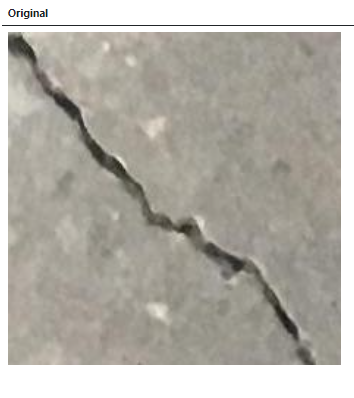
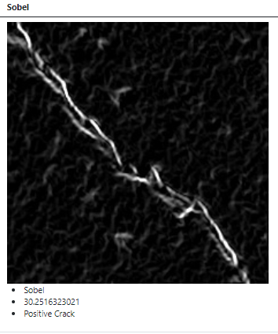
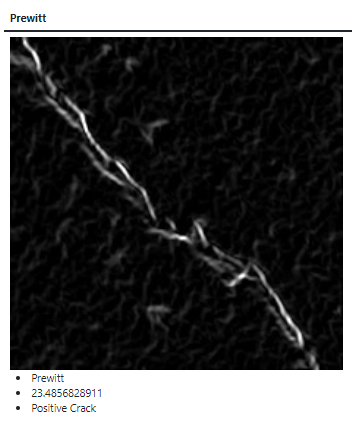
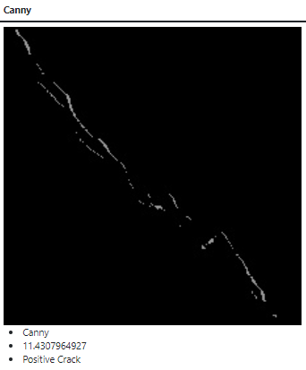
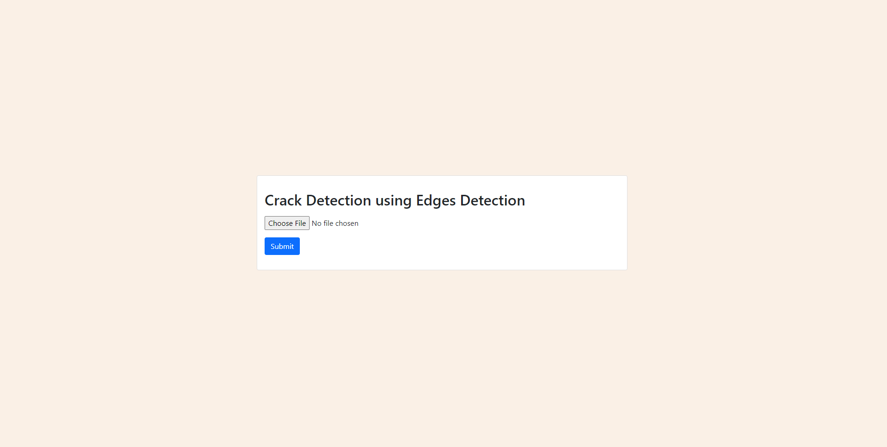
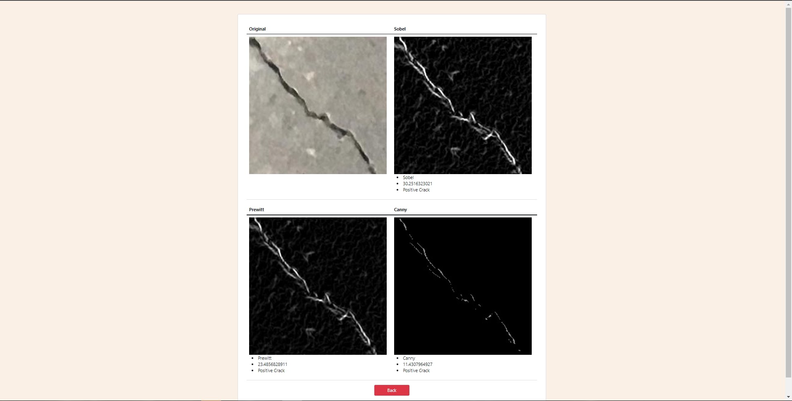

# Flask-Task1

This program receive an concrete image 



and will classify it with three diferent edge detections method.

<p float="left">
  
   
   
</p>

# Run this app via Docker
## `irfanheru66/nodeflux_task1`

# Docker Pull
```
docker pull irfanheru66/nodeflux_task1:3.0
```
# Docker Run
```
docker run -p 5000:5000 irfanheru66/nodeflux_task1:3.0
```
- after that, on your local browser clik localhost:5000

# You can use this app via HTML

<p float="left">
  
   
</p>

# Or, you can use the api
```
localhost:5000/api
```
- Send image that are already being converted to Base64

```
{
    image:"Base64 Converted String"
}
```

- The return that you will get is

```
        {
            "name": "Sobel",
            "std": "stdValue",
            "verdict": "crack verdict"
        },
        {
            "name": "Prewitt",
            "std": "stdValue",
            "verdict": "crack verdict"
        },
        {
            "name": "Canny",
            "std": "stdValue",
            "verdict": "crack verdict"
        },

        {
            "cannyImg":"Base64 Converted Image"
            "prewittImg":"Base64 Converted Image"
            "sobelImg":"Base64 Converted Image"

        }
```
